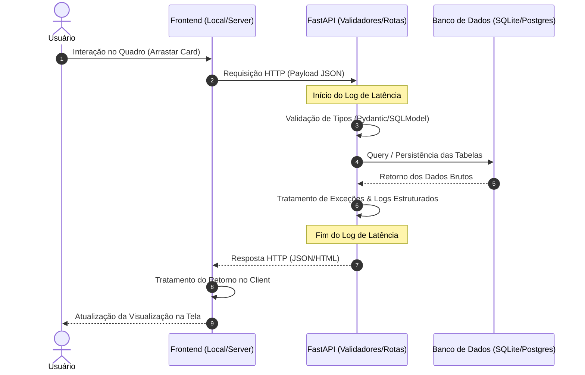
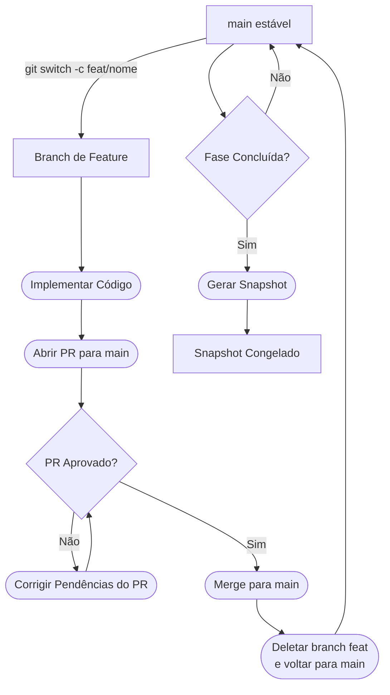

# Kanban Poliglota

## 🎯 Visão Geral e Proposta de Valor

O **kanban_poliglota** é uma Prova de Conceito (PoC) incremental desenvolvida de forma autônoma. O objetivo central do projeto é validar na prática teorias de arquitetura de software, transição de paradigmas (monolito para microsserviços) e avaliar o comportamento do sistema sob o impacto de diferentes decisões de engenharia.

Mais do que um gerenciador de tarefas funcional, este repositório serve como um laboratório de infraestrutura e observabilidade. Cada evolução técnica (fase) passará por uma checagem rigorosa de telemetria para registrar, comparar e entender as vantagens, desvantagens e o real custo de oportunidade de cada stack tecnológica implementada.

## 💡 Motivação (O Cenário de Mercado)

Na indústria de desenvolvimento, é crônico o surgimento de sistemas legados que sofrem com degradação contínua de desempenho, ausência de padrões arquiteturais homogêneos, falta de documentação viva e commits genéricos que obscurecem o histórico evolutivo.

Com o passar do tempo, a ausência de metodologias como TDD (Test-Driven Development) e o acoplamento severo com frameworks transformam a manutenção de código alheio em uma tarefa complexa e de alto risco. Consequentemente, essas aplicações passam a consumir recursos computacionais de forma ineficiente, elevando os custos operacionais de infraestrutura de servidores de maneira desnecessária.

Este projeto nasce da necessidade de contrapor esse cenário na prática. O intuito é provar como a adoção de uma arquitetura limpa, aliada a ferramentas de conteinerização, automação de esteiras (CI/CD) e a introdução estratégica de linguagens de alta performance (como Go e Rust) pode reverter o desperdício de hardware, mantendo o sistema robusto, manutenível e escalável.

## 🔄 Fluxo de Funcionamento e Observabilidade

Para auditar o comportamento do sistema e identificar gargalos sem depender de suposições técnicas, a aplicação implementará logs estruturados em formato JSON. O objetivo é mapear o tempo gasto em cada etapa do ciclo de vida de uma requisição, seguindo o fluxo visual abaixo:

## 🔬 O que este projeto analisa? (Critérios de Telemetria)

Para mitigar achismos técnicos, o comportamento da aplicação é monitorado por meio de logs estruturados em formato JSON, mapeando o ciclo completo da requisição. O foco analítico está concentrado em quatro indicadores fundamentais:

- **Latência de Ponta a Ponta:** Tempo decorrido desde o disparo do payload no cliente até a renderização do retorno.
- **Pegada de Memória (Memory Footprint):** Consumo de RAM em estado de repouso (idle) e sob estresse de concorrência.
- **Eficiência de CPU:** Overhead de processamento imposto por camadas de virtualização (Docker/Kubernetes) e runtimes de linguagens.
- **Tamanho do Artefato:** Densidade e portabilidade do deploy (Binário standalone compilado vs. Imagem de container).

## 💻 Especificação Física do Laboratório (O Hardware Real)

Como o laboratório opera em uma abordagem estritamente On-Premises (infraestrutura própria), o comportamento das fases será confrontado diretamente entre dois ambientes de hardware distintos para isolar o impacto do sistema operacional e da arquitetura do chip:

| Parâmetro | PC Principal | PC Servidor |
| --- | :-: | :-: |
| Sistema Operacional | Windows 11 Pro | Linux Ubuntu Server |
| Processador | AMD Ryzen 5 8600G | Intel Core i7-2600 |
| Memória RAM | 16 GB DDR5 | 16 GB DDR3 |
| Armazenamento | SSD NVMe 1 TB | SSD 256 GB + HD 500 GB |
| Foco de Teste | Execução nativa, geração de binários executáveis standalone e validação local localhost. | Conteinerização de alta densidade, proxies reversos bare-metal, automação de deploy contínuo (CD) e orquestração de microsserviços. |

## 🌿 Estratégia de Branches (Snapshots)

Para permitir a reprodutibilidade dos testes de desempenho e auditoria retrospectiva, cada fase concluída do projeto será eternizada em uma branch de snapshot estático (ex: snapshot/fase-01). Isso possibilita alternar entre as fases arquiteturais no mesmo hardware para executar benchmarks comparativos diretos.

## 🐙 Governança de Desenvolvimento (Issues & Pull Requests)

Para simular o fluxo de engenharia de grandes projetos de mercado, o desenvolvimento deste ecossistema segue regras rígidas de ciclo de vida:

1. **Rastreamento por Issues:** Nenhuma linha de código ou documento é modificado sem uma Issue associada descrevendo os requisitos.
2. **Branches de Trabalho Dinâmico:** O trabalho ocorre em branches isoladas (ex: `feat/caso-de-uso`, `docs/diagramas`). Commits parciais devem referenciar o número da Issue para manter a linhagem histórica do código.
3. **Integração via Pull Requests (PRs):** O fechamento de uma fase ocorre através de um Pull Request direcionado à branch `main`. O PR deve conter o relatório descritivo dos logs de benchmark obtidos, servindo como documentação histórica de auditoria de performance antes do merge.

## 🗺️ O Cronograma de 9 Etapas (Fase 0 à Fase 8)

| Fase | Resumo Macro | Detalhes | Status |
| --- | --- | --- | --- |
| 00 | Engenharia de Requisitos e Modelagem Conceitual | [Ver Planejamento Conceitual](docs/fase_00.md) |  |
| 01 | Monolito Portátil Local | [Ver Especificação Técnica](docs/fase_01.md) |  |
| 02 | Persistência de Produção e Migrações | [Ver Especificação Técnica](docs/fase_02.md) |  |
| 03 | Conteinerização e Isolamento de Ambiente | [Ver Especificação Técnica](docs/fase_03.md) |  |
| 04 | Deploy On-Premises e Roteamento | [Ver Especificação Técnica](docs/fase_04.md) |  |
| 05 | Integração Contínua e Automação de Testes | [Ver Especificação Técnica](docs/fase_05.md) |  |
| 06 | Deploy Contínuo com Agentes Isolados | [Ver Especificação Técnica](docs/fase_06.md) |  |
| 07 | Desacoplamento e Expansão Poliglota | [Ver Especificação Técnica](docs/fase_07.md) |  |
| 08 | Orquestração Elástica e Telemetria | [Ver Especificação Técnica](docs/fase_08.md) |  |
