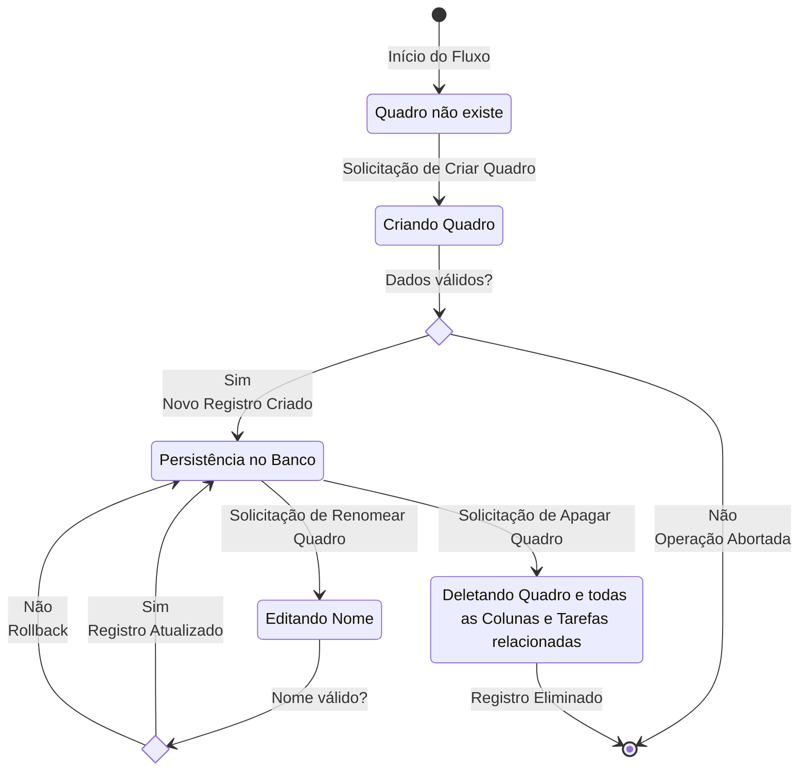
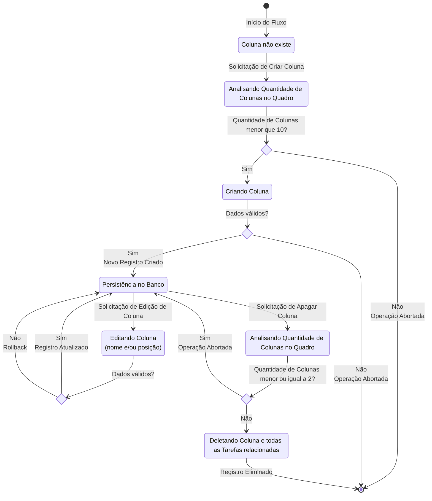
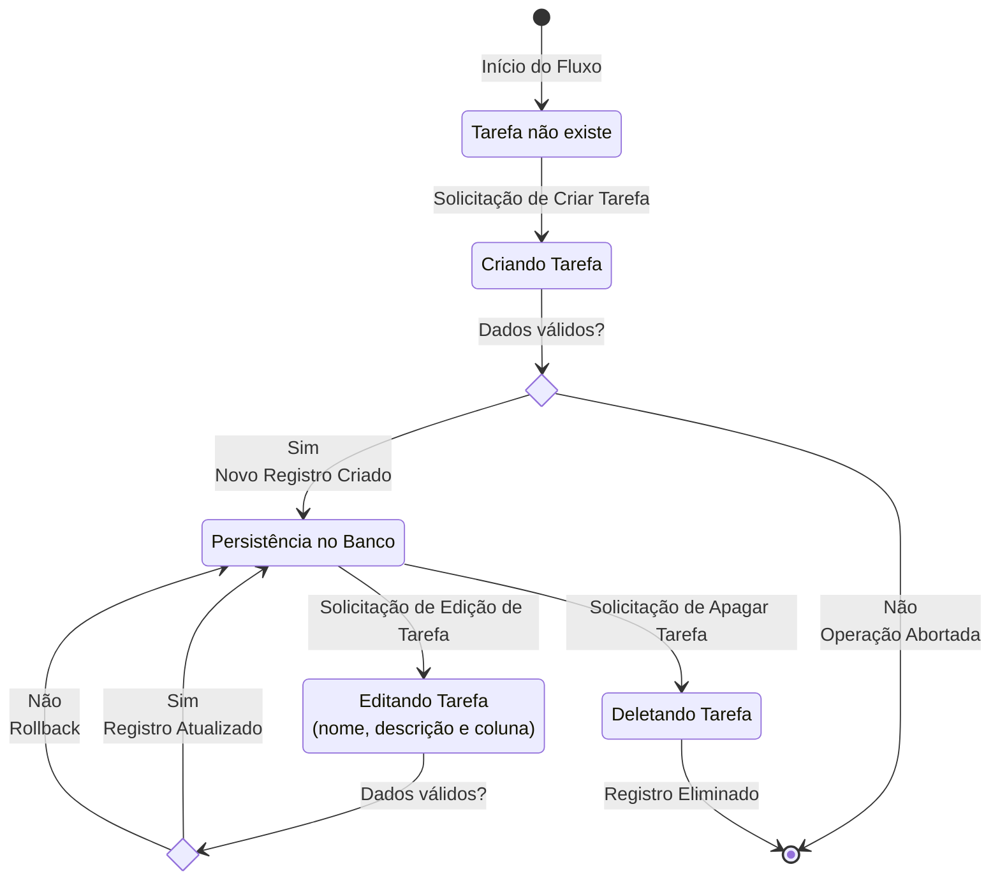

# Diagrama de Estados das Entidades do Kanban

A seguir será apresentado o diagrama de estados que descreve o ciclo de vida dos **Quadros**, **Colunas** e **Tarefas** do kanban, incluindo os eventos que disparam as transições de estado e as condições de guarda que determinam a validade das operações.

> Estes diagramas são úteis para entender o comportamento das entidades ao longo do tempo e suas alterações dentro do banco de dados.

## Quadro

A validação do nome do Quadro ocorre de forma semelhante em `Criando Quadro` e `Editando Nome`, assumindo os seguintes critérios:

- O nome deve ser único (`Unique`).
- O nome não pode ser nulo (`Not Null`).
- O nome deve ter no máximo 50 caracteres (`String(50)`).

## Coluna

Fluxo semelhante ao de Quadro, seguindo os mesmos critérios de validação de nome, com a diferença de um novo atributo (`posição`) que também deve ser validado para garantir a unicidade *dentro do Quadro*:

- O nome deve ser único *dentro do Quadro* (`Unique`).
- O nome não pode ser nulo (`Not Null`).
- O nome deve ter no máximo 50 caracteres (`String(50)`).
- A posição deve ser única *dentro do Quadro* (`Unique`).

> **Nota:** A existência de colunas dependende necessariamente da existência de um quadro, portanto, não é possível criar uma coluna sem que exista um quadro.

## Tarefa/Cartão

A validação do nome da Tarefa ocorre de forma semelhante em `Criando Tarefa` e `Editando Tarefa`, assumindo os seguintes critérios:

- O nome deve ser único *dentro do Quadro* (`Unique`).
- O nome não pode ser nulo (`Not Null`).
- O nome deve ter no máximo 50 caracteres (`String(50)`).
- A descrição pode ser nula (`Optional`).
- A descrição deve ter no máximo 255 caracteres (`String(255)`).
- A coluna deve existir e pertencer ao Quadro da Tarefa (`Foreign Key`).

> **Nota:** A existência de tarefas dependende necessariamente da existência de uma coluna, portanto, não é possível criar uma tarefa sem que exista uma coluna.

